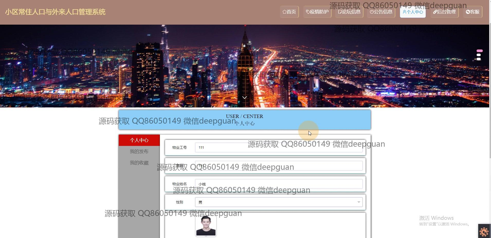
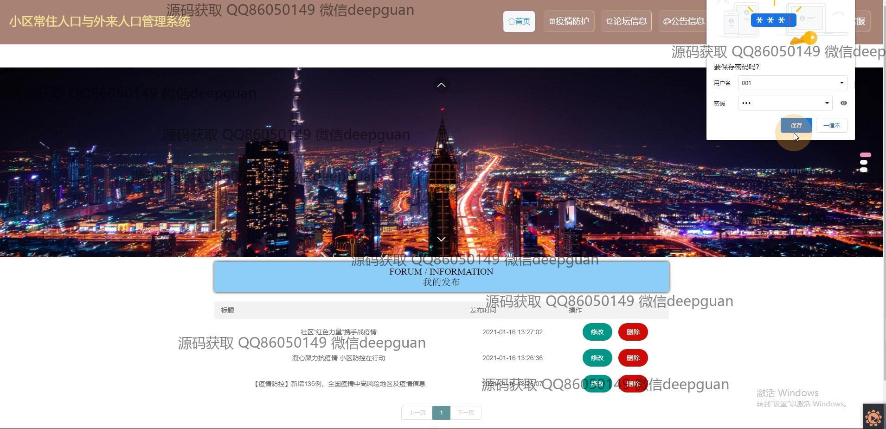

<h1 align="center">小区常住与外来人口疫情防控管理系统vue</h1>

## 简介
小区常住与外来人口疫情防控管理系统：角色分为管理员和用户；具备业主管理、疫情防护、信息发布、物业管理、论坛交互、个人中心等功能，实现社区疫情防控的高效管理。    --计算机毕业设计源码；毕设源码；java毕业设计源码

## 联系方式

<h3 align="center">获取完整代码与数据库文件 + 微信：deepguan QQ: 86050149 QQ群: 783742310</h3>

<h3 align="center">可帮忙远程部署 包运行成功！提供远程部署、修改代码、设计文档指导、代码讲解等服务！</h3>

## 功能介绍（完整见运行截图）
管理员： 管理员可以通过业主管理、外来人口管理、疫情防护管理等模块查看和管理小区的常住和外来人口信息，支持信息录入、编辑和删除功能。此外，还可以管理系统公告、论坛帖子的审核及后台维护，通过报表功能进行数据统计和打印。个人中心模块提供个人信息管理及登录退出功能。

小区居民： 作为小区居民，用户可以在个人中心查看和更新个人信息，进行疫情相关信息上报，包括健康状况、外出情况等。同时，通过论坛功能，居民可以发布和参与话题讨论，获取社区公告和最新疫情政策。用户还可以在个人中心查看历史记录和收藏的信息。

外来人员： 外来人员需在系统进行信息登记，填写基本情况、来访目的和计划离开时间，便于社区防控管理。外来人员也可以在论坛中查看公告和防疫信息，遵守社区防控指引。用户支持功能提供在线客服咨询服务。

物业管理人员： 物业管理人员负责社区内日常防护措施的执行和记录，通过系统上传相关图片及报告，确保防疫措施落实到位。他们还协助居民和外来人员的信息采集和整理，定期更新社区的防疫动态，确保数据的准确性和及时性。

## 运行截图

本代码来源于网络,仅供学习参考使用!

